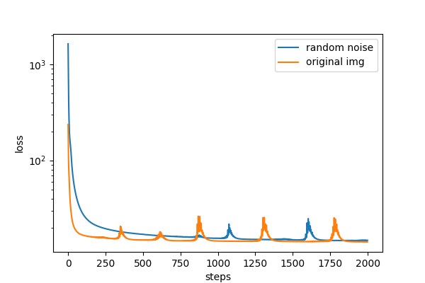

# Neural Style Transfer

<a href="https://www.loom.com/share/ce0c5ba41aab41449a9092930b9b70f5">Link to video presentation</a>

## Introduction

The idea of artistic style transfer is to minimize content loss and style loss between the reconstructed image and the original image.

The implementation of this project is based on this paper - [Image Style Transfer Using Convolutional Neural Networks](https://www.cv-foundation.org/openaccess/content_cvpr_2016/papers/Gatys_Image_Style_Transfer_CVPR_2016_paper.pdf) using a pretrained VGG19 model for feature encoding. I have also tried using EfficientNet-B0 for feature encoding but did not produce good results compared to traditional VGG19. In this project in addition to initializing a reconstructed image with random noise like the other projects have commonly done, I decided to also initialize with a copy of a content image and observe any different results.

Almost all the implementation in this project is mine except the total variation loss which I refer from this Pytorch forum - [
Implement total variation loss in pytorch](https://discuss.pytorch.org/t/implement-total-variation-loss-in-pytorch/55574).

### Content Loss

Image content can simply be represented by an output of some layer in the network. The deeper layer outputs will represent more high-level feature.
Content loss is defined by mean square error between the features corresponding to layer l of the original image and the reconstructed image.

Given:
- $$P$$ = feature output of layer $$l$$ of the original image
- $$F$$ = feature output of layer $$l$$ of the reconstucted image

Content loss can be written in the following expression:
- $$L_{\text{content}} = \frac{1}{K_l H_l W_l} \sum_{i, j, k} (F^l_{ijk} - P^l_{ijk})^2$$ where $$K_l$$ = number of filters $$H_l$$ = feature's height $$W_l$$ = feature's width

### Style Loss

Image style can be represented by an inner product of an output feature of each layer.
A matrix resulted from computing an inner product is called a Gram matrix which can be written in the following expression:
- $$G^l_{ij} = \sum_{k} F_{ik}^l F_{jk}^l$$ where $$k$$ = pixel, $$i, j$$ = filter

Given:
- $$A^l$$ = style representation of layer $$l$$ of the style image
- $$G^l$$ = style representation of layer $$l$$ of the reconstructed image

Style loss can be written in the following expression:
- $$L_{\text{style}}^l = \frac{1}{K_l W_l H_l} \frac{1}{K_l^2} \sum_{i, j} (G^l_{ij} - A^l_{ij})^2$$ where $$K_l$$ = number of filters $$H_l$$ = feature's height $$W_l$$ = feature's width

The mean square error is scale by the number of pixels presented in the output feature.

The total style loss will be a weighted sum of all style representations. Typically, the weight should decrease as it goes deeper into the network since we want to prioritize low-level features to imitate the actual styles more closedly.

$$L_{\text{style}} = \sum_l w_l L_{\text{style}}^l$$

The total loss will be a weighted sum between the content loss and the style loss

$$L_{\text{total}} = \alpha L_{\text{content}} + \beta L_{\text{style}}$$

However, to construct a smoother image, we will also introduce a total variation loss which is sum squared differences between a pixel and its neighboring pixels.

$$L_{\text{tv}} = \sum_{i, j, k} (T_{i, j+1, k} - T_{i, j, k})^2 + (T_{i+1, j, k} - T_{i, j, k})^2$$ where T is the reconstructed image

Now, the formula for total loss is

$$L_{\text{total}} = \alpha L_{\text{content}} + \beta L_{\text{style}} + \gamma L_{\text{tv}}$$

## Methodology

- Style representations are computed from feature outputs of the first layer and all the max-pool activations in a pretrained VGG19 network (`conv1_2` and activated outputs of `conv1_2`, `conv2_2`, `conv3_4`, `conv4_4`, `conv5_4`) according to the model architecture below.

 

Illustration of VGG19's model architecture from 
<a href="https://www.researchgate.net/figure/llustration-of-the-network-architecture-of-VGG-19-model-conv-means-convolution-FC-means_fig2_325137356">ResearchGate</a>

- Content is defined by an activated output of `conv3_4`

- The reconstructed image is either initialized as random noise or a copy of the original image.

- The reconstructed image and style image are fed into two networks. The loss is computed with the formula mentioned above and backpropagated through the reconstructed image (each parameter is a pixel value itself).

## Results and Experiments

##### **Content Image**
 
retrieved from nbcnews.com

### Tuning style weight

A larger weight to style loss produces a reconstructed image more resembling the style image than the content image.

### Tuning total variation loss weight

A larger weight to total variation loss produces a smoother reconstruted image.

### Initializing with random noise vs a copy of the content image

#### **Style Image 1**
 
retrieved from fineartamerica.com

#### **Result**

#### **Style Image 2**
 
The Starry Night retrieved from sanctuarymentalhealth.org

#### **Result**

#### **My own artwork style**

This is my own artwork I tested it out just for fun.

#### **Result**

#### **Loss**

As observed, initializing a reconstructed image with a copy of the content image helps boost the recontruction process and reach the optimal point faster while producing an image that captures the content of the original image better. 


